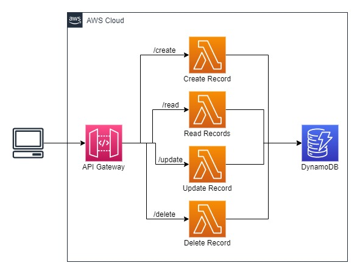

# Complete CRUD Application with AWS Serverless
## Architecture


Let me explain the simple architecture and which AWS service is used for which purposes in the above architecture.
- API Gateway: It is used to create API to communicate with backend services on a particular path.
- Lambda Function: It is used to perform a particular task, such create a new record, updating a record, reading all records, delete a record.
- DynamoDB: It is used to store all records.

## Pre-requisites

- AWS SAM must be installed on your machine. For installation, you can follow the official documentation
https://docs.aws.amazon.com/serverless-application-model/latest/developerguide/serverless-getting-started.html

- AWS CLI must be installed on your machine, and AWS Credentials must be configured.
- AWS Credentials must be configured. However, if you have installed AWS CLI previously and configured AWS Credentials before then, you don't need to set up AWS Credentials because AWS SAM will fetch your AWS Credentials automatically.
- If you haven't configured AWS Credentials yet, you need to get your AWS Credentials from the AWS Console. For more information visit the below link.
https://docs.aws.amazon.com/serverless-application-model/latest/developerguide/serverless-getting-started-set-up-credentials.html

## Implementation
- Clone the GitHub repository, go to that repository, and open that project in any code editor.
https://github.com/ParthTrambadiya/crud-application-sam
```
git clone https://github.com/ParthTrambadiya/crud-application-sam.git
cd crud-application-sam
```

- Now, we are ready to deploy our stack on AWS. To do that, run the below command.
```
sam deploy --guided
```
- Once the stack is deployed successfully, you will get output in the terminal, so from the terminal copy the following values from the terminal, ApiBaseUri, StackStage, and paste in any text editor.
- Now, we need to provide ApiBaseUrl and StackStage to our javascript code to call API, for that update these values in `app/js/config.js` a file.
- Now you are ready to test your CRUD application.

## Cleanup
- Open a terminal in the root of the project and run the below command to remove a deployed stack.
```
aws cloudformation delete-stack --stack-name <stack-name> --region <aws-region>
```


